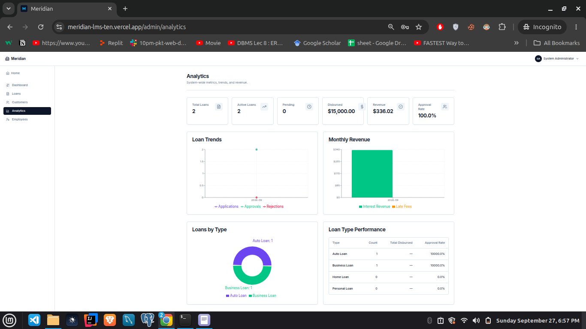
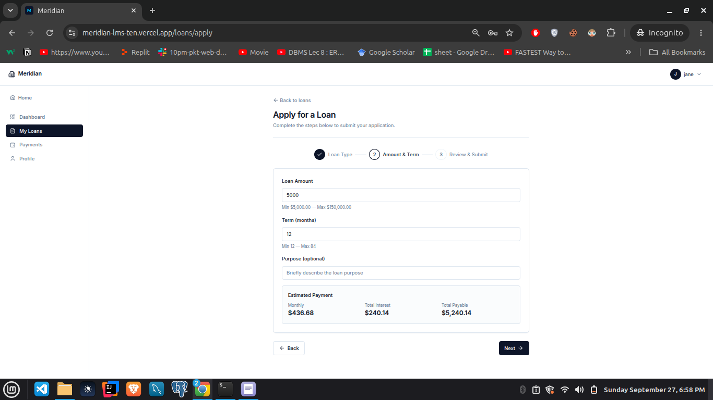
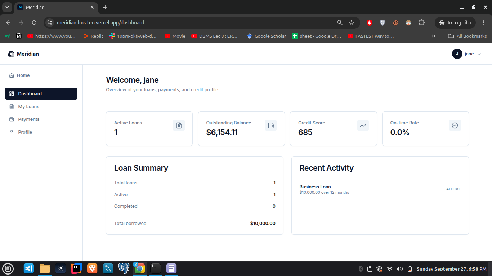

# Meridian LMS


A production-minded loan management platform with customer portal, admin dashboard, real-time analytics, and AI-assisted credit narratives.

**Stack:** Spring Boot 4.1.1 · Java 25 · PostgreSQL 16 · Redis 7 · Next.js 15 · React 19

---

## Table of Contents

- [Live Demo](#live-demo)
- [Features](#features)
- [Architecture](#architecture)
- [Quick Start](#quick-start)
- [Demo Credentials](#demo-credentials)
- [Project Structure](#project-structure)
- [Testing](#testing)
- [Environment Variables](#environment-variables)
- [Documentation](#documentation)
- [Roadmap](#roadmap)
- [Known Limitations](#known-limitations)

---

## Live Demo

| Service | URL |
|---|---|
| Frontend | https://meridian-lms-ten.vercel.app |
| API | https://meridian-lms-production.up.railway.app |
| Swagger UI | https://meridian-lms-production.up.railway.app/swagger-ui.html |
| Actuator Health | https://meridian-lms-production.up.railway.app/actuator/health |

> Backend deployed on Railway Hobby ($5/mo). No cold starts.

---

## Screenshots

### Admin Analytics Dashboard


### Loan Application Wizard


### Customer Dashboard


---

## Features

### Customer Portal
- Register & login with JWT authentication
- Apply for loans via a multi-step wizard with **live amortization preview**
- View full repayment schedule per loan
- Make payments with **idempotency keys** (safe retries)
- Track credit score changes on payment
- Profile management with credit score chart

### Admin / Staff Panel
- **Admin:** full system access including employee management
- **Employees:** granular role-based access via per-permission grants
- Loan review workflow: `PENDING → APPROVED / REJECTED → ACTIVE → COMPLETED`
- Auto-generated amortized payment schedule on approval
- Per-customer detail page with AI-generated credit risk narrative
- System-wide analytics with loan trends, revenue, and loan-type breakdown
- Customer management (suspend / activate)

### Analytics Module
- Loan volume trends (time series)
- Revenue tracking (interest + late fees)
- Approval rate tracking
- Loan-type distribution (pie + table)
- KPI cards: total loans, active, revenue, avg credit score

### Credit Scoring Engine
- Starting score: **650** · Range: **300–850**
- Score events:

  | Event | Δ |
  |---|---|
  | Loan approved | **+10** |
  | Payment on time | **+5** |
  | Payment late | **−10** |
  | Loan rejected | **−5** |
  | Loan completed | **+25** |

### AI Credit Narratives
- Provider-agnostic via Spring AI 2.0.1 (`ChatModel` interface)
- Redis-cached (24h TTL) with Resilience4j circuit breaker
- Template-based fallback when the model is unavailable
- Zero-cost operation: `AI_ENABLED=false` disables LLM calls entirely

---

## Architecture

```
┌──────────────────────────────────────────────────────┐
│                  Vercel / Docker                     │
│  ┌──────────────┐        ┌───────────────────────┐   │
│  │  Next.js 15  │───────▶│   Spring Boot 4.1.1   │   │
│  │  React 19    │  JWT   │   Java 25             │   │
│  │  :3000       │        │   :4000               │   │
│  └──────────────┘        └──────┬────────────────┘   │
│                                  │                   │
│                  ┌───────────────┼───────────────┐   │
│                  ▼               ▼               ▼   │
│           ┌────────────┐  ┌─────────┐     ┌─────────┐│
│           │ PostgreSQL │  │  Redis  │     │ OpenAI  ││
│           │     16     │  │    7    │     │ (opt.)  ││
│           └────────────┘  └─────────┘     └─────────┘│
└──────────────────────────────────────────────────────┘
```

| Layer | Technology |
|---|---|
| Backend | Spring Boot 4.1.1, Java 25, Spring Security 7 |
| Database | PostgreSQL 16 + Flyway (V1–V11) |
| Cache | Redis 7 |
| Auth | JWT (HS512) + BCrypt cost 12 |
| AI | Spring AI 2.0.1 (provider-agnostic) |
| Audit | Hibernate Envers 7.4.5 |
| Frontend | Next.js 15, React 19, TypeScript, Tailwind 3.4 |
| Testing | JUnit 5, MockMvc, Testcontainers 1.21.3 |
| Observability | Actuator, Micrometer, Prometheus, Grafana |
| API Docs | SpringDoc OpenAPI 3.1.0 |

---

## Quick Start

### With Docker (recommended)

```bash
git clone https://github.com/Syed-Mohsin-Raza/meridian-lms
cd meridian-lms
cp .env.example .env

docker compose up -d
```

- Frontend: http://localhost:3000
- Backend: http://localhost:4000
- Swagger: http://localhost:4000/swagger-ui.html
- Health: http://localhost:4000/actuator/health

First run: ~3 minutes (builds + Flyway migrations). Subsequent: ~15 seconds.

### Local development (without Docker)

```bash
# Start dependencies only
docker compose up -d postgres redis

# Backend
cd backend
sg docker -c "./mvnw spring-boot:run"

# Frontend (new terminal)
cd frontend
npm install
echo "NEXT_PUBLIC_API_BASE_URL=http://localhost:4000" > .env.local
npm run dev
```

---

## Demo Credentials

| Role | Email | Password |
|---|---|---|
| Admin | admin@lms.com | Admin@1234 |
| Employee | goku@gmail.com | Goku@1234 |

> Change all passwords before any production use.

---

## Project Structure

```
meridian-lms/
├── backend/
│   ├── Dockerfile
│   ├── pom.xml
│   └── src/
│       ├── main/
│       │   ├── java/com/meridian/lms/
│       │   │   ├── ai/           # Spring AI + fallback
│       │   │   ├── audit/        # Envers revision entities
│       │   │   ├── config/       # Security, Redis, OpenAPI
│       │   │   ├── controller/   # REST endpoints
│       │   │   ├── dto/          # Request / Response records
│       │   │   ├── entity/       # JPA entities
│       │   │   ├── repository/   # Spring Data JPA
│       │   │   ├── security/     # JWT, RBAC, rate limiting
│       │   │   ├── service/      # Business logic
│       │   │   └── util/         # AmortizationCalculator
│       │   └── resources/
│       │       ├── application.yml
│       │       └── db/migration/ # Flyway V1–V11
│       └── test/                 # JUnit 5 + Testcontainers
│
├── frontend/
│   ├── src/
│   │   ├── app/                  # Next.js App Router
│   │   │   ├── (auth)/           # login, register
│   │   │   ├── (customer)/       # dashboard, loans, payments, profile
│   │   │   └── admin/            # analytics, loans, customers, employees
│   │   ├── components/           # UI primitives + feature components
│   │   ├── lib/
│   │   │   ├── api/              # Per-domain API clients
│   │   │   ├── auth/             # Token storage
│   │   │   └── hooks/            # use-auth, use-pagination
│   │   └── middleware.ts         # Route protection
│   └── package.json
│
├── docs/
│   ├── auth.md                   # Auth design + migration tiers
│   ├── scaling.md                # Scale path
│   ├── security/                 # ZAP baseline results
│   └── load-testing/             # k6 results
│
├── load-testing/                 # k6 scripts
├── monitoring/                   # Prometheus config
├── docker-compose.yml
└── README.md
```

---

## Testing

### Backend — 51 tests, Testcontainers

```bash
cd backend
sg docker -c "./mvnw test"
```

Coverage:

| Test Class | Count | Covers |
|---|---|---|
| AmortizationCalculatorTest | 12 | Math correctness |
| AuthControllerTest | 7 | Register, login, JWT, me |
| LoanControllerTest | 2 | Loan lookup, error paths |
| PaymentServiceTest | 5 | Payments, idempotency |
| LoanServiceTest | 6 | Apply, approve, reject, credit score |
| EmployeeServiceTest | 3 | CRUD, permissions |
| CustomerServiceTest | 3 | Suspend/activate |
| AnalyticsServiceTest | 2 | Dashboard KPIs |
| AuditServiceTest | 2 | Envers revision tracking |
| RateLimitFilterTest | 2 | Rate limit behavior |
| AI tests | 6 | Fallback + cache |
| LmsApplicationTests | 1 | Context startup |

### Frontend

```bash
cd frontend
npm run typecheck
npm run lint
npm run build
```

### Load testing (k6)

See `docs/load-testing/` — 4 scenarios (smoke, auth, loans, ai-fallback) with JSON summaries committed.

### Security scan (OWASP ZAP)

Baseline scan: 0 High / 0 Medium / 0 Low. See `docs/security/`.

---

## Environment Variables

| Variable | Default | Description |
|---|---|---|
| POSTGRES_HOST | localhost | DB host |
| POSTGRES_PORT | 5432 | DB port |
| POSTGRES_DB | loan_management | DB name |
| POSTGRES_USER | lms_user | DB username |
| POSTGRES_PASSWORD | lms_secret_2026 | DB password |
| REDIS_URL | redis://localhost:6379 | Redis URL |
| JWT_SECRET | (dev fallback) | HS512 signing key (64+ chars) |
| JWT_EXPIRY_MS | 43200000 | Token lifespan (12h) |
| CORS_ALLOWED_ORIGINS | http://localhost:3000 | Comma-separated origins |
| AI_ENABLED | false | Enable LLM narratives |
| OPENAI_API_KEY | (empty) | OpenAI key (empty = template fallback) |
| AI_MODEL | gpt-4o-mini | Chat model name |

Frontend:

| Variable | Default | Description |
|---|---|---|
| NEXT_PUBLIC_API_BASE_URL | http://localhost:4000 | Backend base URL (baked at build) |

---

## Documentation

- [Authentication design + migration tiers](docs/auth.md)
- [Security scan results](docs/security/README.md)
- [Load testing results](docs/load-testing/README.md)
- [Scaling path](docs/scaling.md)

---

## Roadmap

- [ ] Partial payment support
- [ ] Credit score history tracking
- [ ] Loan cancellation flow
- [ ] Officer assignment workflow
- [ ] Two-step approval (employee → manager)
- [ ] Frontend: httpOnly cookie auth migration (Tier 3)
- [ ] Redis-backed rate limiter for horizontal scale
- [ ] Batch-query customer aggregates

---

## Known Limitations

- JWT stored in sessionStorage (Tier 2 of 4 — see `docs/auth.md`)
- Rate limiter is in-memory (single-instance only)
- AI narratives fall back to a template when the model is unavailable
- No payment gateway integration — payments are recorded, not processed
